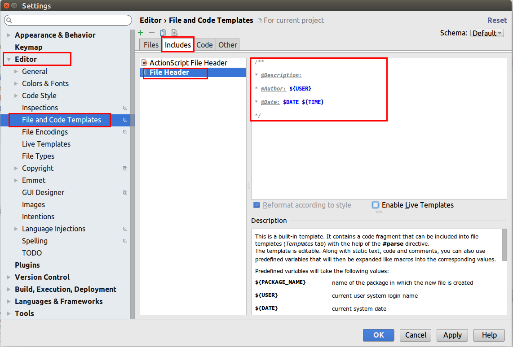
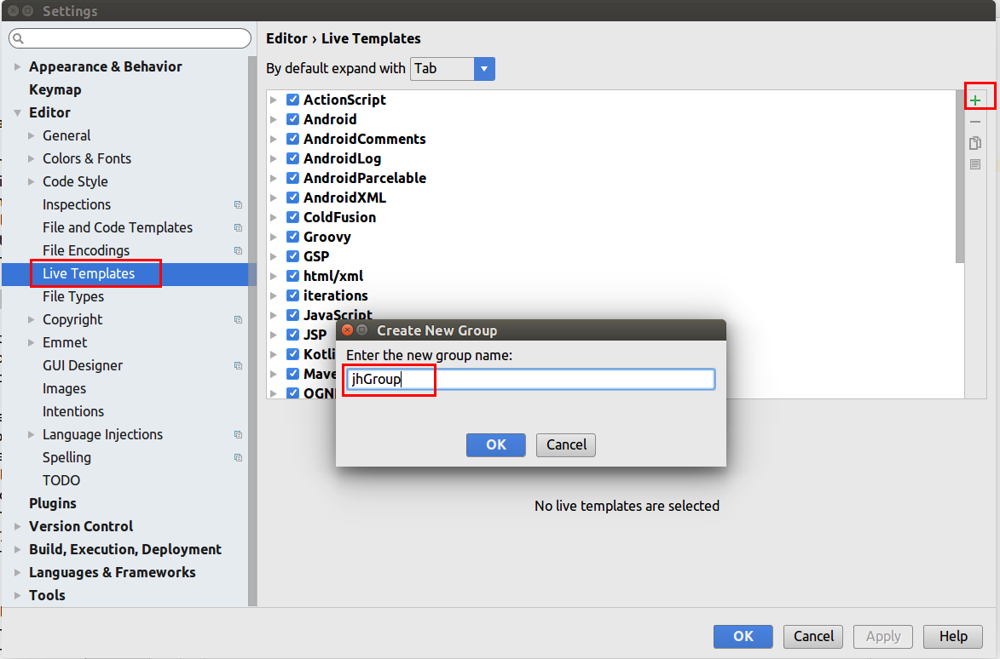
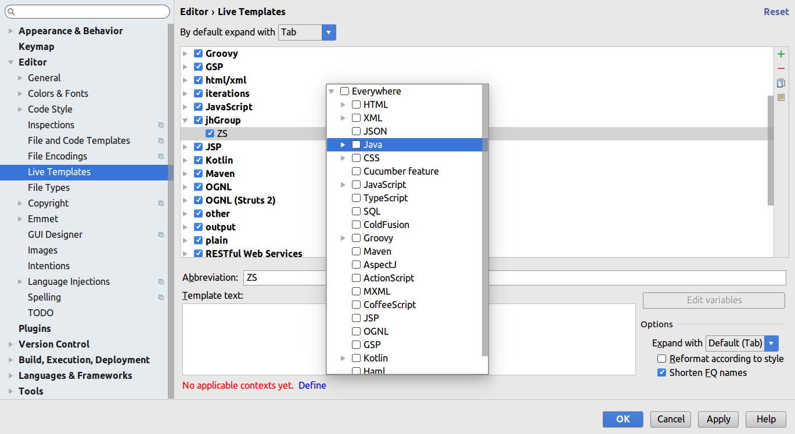
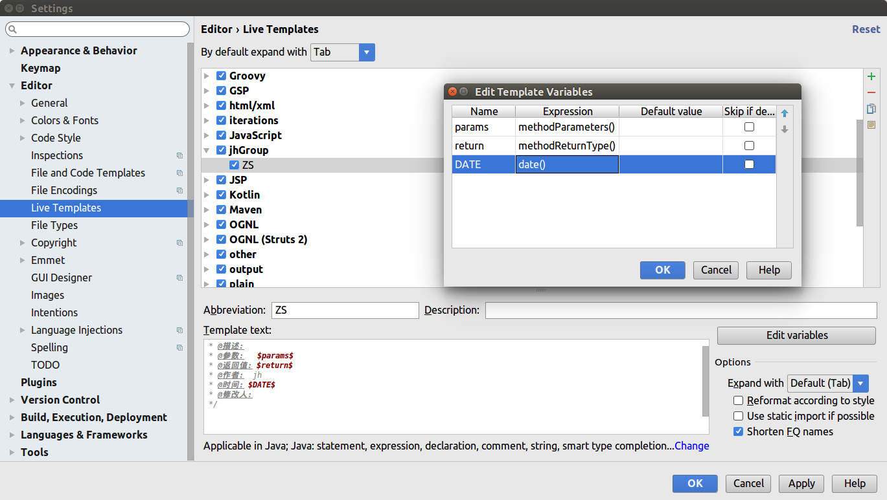
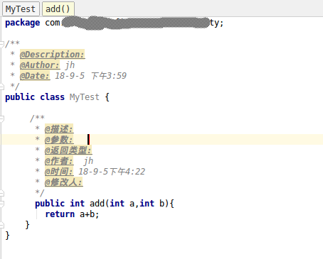

# IntelliJ-IDEA


### 快捷键学习


| 功能                                       | 快捷键            | 说明                               |
| ---------------------------------------- | -------------- | -------------------------------- |
| java代码快速敲出public static void main(String[] args) | psvm+tab       |                                  |
| java代码快速敲出System.out.println();          | sout+tab       |                                  |
| java代码快速敲出public static final            | psf+tab        |                                  |
| 多行注释/取消多行注释                              | ctrl+/         |                                  |
| 自动缩进代码                                   | ctrl+alt+i     |                                  |
| 多行合成一行                                   | ctrl+shift+j   |                                  |
| 快速定位错误代码                                 | F2             |                                  |
| 把当前选中的代码向上/下移动                           | ctrl+shift+↑/↓ |                                  |
| 切换代码视图标签（打开的文件）                          | alt+←/→        |                                  |
| 在代码中的方法之间快速移动定位                          | alt+↑/↓        |                                  |
| 自动导入包、自动处理throws Exception               | alt+enter      |                                  |
| 显示文件outline大纲                            | alt+7          | View-->Tool Windows-->Structure  |
| 自动生成setter和getter方法                      | alt+insert     | 右键-->Generate...-->Setter/Getter |
| 进入调用方法                                   | F7             |                                  |
| 智能进入调用方法                                 | shift+F7       |                                  |
| 强制进入调用方法                                 | alt+shift+F7   |                                  |
| 单步运行                                     | F8             |                                  |
| 跳出调用方法                                   | shift+F8       |                                  |
| 表达式评估（选中查看值）                             | alt+F8         |                                  |
| 运行到下一个断点                                 | F9             |                                  |
| 重新开一个进程运行上次断点测试                          | shift+F9       |                                  |
| 运行到光标                                    | alt+F9         |                                  |
| 调试光标所在方法或类                               | ctrl+shift+F9  |                                  |
| 运行光标所在方法或类                               | ctrl+shift+F10 |                                  |


### 安装后配置

**jdk设置**


**外观字体设置**

程序字体：File -> Settings -> Editor -> Colors & Fonts -> Font


**插件**


### JavaDoc


**1、定义java文件头部的注释**

File -> Settings -> Editor -> File and Code Templates  -> Includes  ->  File Header

```
 /**
 * @Description:
 * @Author: ${USER}
 * @Date: $DATE ${TIME}
 */
```


 


**2、java类中的方法添加上注释**

1、File -> Settings -> Editor -> File and Code Templates 勾选中 “Enable  Live  Templates” 

2、File -> Settings -> Editor -> Live Templates 然后点右上方的+，选择 “Templates  Group” 新建一个Group


 


3、选中刚才写的Group名字，再点右上方的+，选择 “Live  Templates”，填写Abbreviation，Description，下面图中例子意思是，在Java代码的方法内部输入ZS后，按下Tab或者Enter，IDEA将会在该方法的内部光标位置为我自动生成注释(根据我接下来定义的模板来生成)。  点击下方的Define选择作用域，双击Java，选中Java，表示此模板只对java文件有效。


 


4、在 Templates Text添加注释样例，两个$号内部是参数名称，都有哪些参数呢，你可以点击“Edit variables”，然后在弹窗中Expression列的格子内双击下拉框中自己查看和选择


```
 /**
 * @描述:
 * @参数:   $params$
 * @返回类型: $return$
 * @作者:  $user$
 * @时间: $date$$time$ 
 * @修改人:
 */
```


  


5、验证注释

bugs：在行首输入ZS按下Enter后 public后移一格，对齐不美观，如果在方法内部测试，注释跑到方法内部


 


